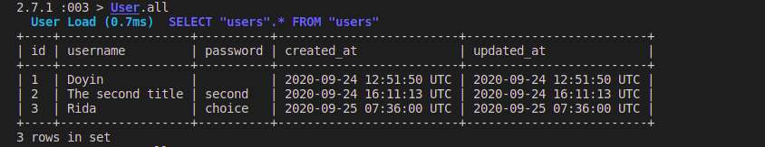

<!-- ABOUT THE PROJECT -->
## About The Project

This project is a come of the model part of the Reddit application.

It focuses on creating Models with validations and associations on rails using Active Record.

This is part of the Odin project curriculum https://www.theodinproject.com/courses/ruby-on-rails/lessons/building-with-active-record-ruby-on-rails

### Built With
This project was built using these technologies.
* Ruby 2.7.1
* Rails 6.0.3.3
* Ubuntu 20.04
* Git Action
* VsCode

### Usage

If you want to test it you need to have Ruby and Rails installed in your computer and [download](https://github.com/euqueme/micro-reddit/archive/master.zip) or clone this repo as follows:
* `$ git clone "https://github.com/Abidoyinsola1/Micro_Reddit.git"`

after that you need to open a terminal inside the repo and run the bundler
* `$ bundle  install --without production`

then, run rails db:migrate. This creates the database with the corresponding tables, columns and associations.
* `$ rails db:migrate`

and finally, you can test it in the console using the sandbox with the following command
* `$ rails console --sandbox`

type ``User``, ``Post`` or ``Comment`` to see the structure of each model

<!-- AUTOMATED TEST -->
### Automated Test

> There are no Automated Test for this project yet

## ✒️ Author 

👤 **Abiola Doyinsola Adeyemi**

- Github: [@Abidoyinsola1](https://github.com/Abidoyinsola1)
- Twitter: [@Abidoyinsola](https://twitter.com/abidoyinsola)
- LinkedIn: [Doyinsola Abiola Adeyemi](https://www.linkedin.com/in/doyinsola-adeyemi)

## 🤝 Contributing

Contributions, issues and feature requests are welcome!

## 👍 Show your support

Give a ⭐️ if you like this project!

## 📝 Acknowledgements

- Microverse and The Odin Project

## 📝 License

This project is free to use as learning purposes.